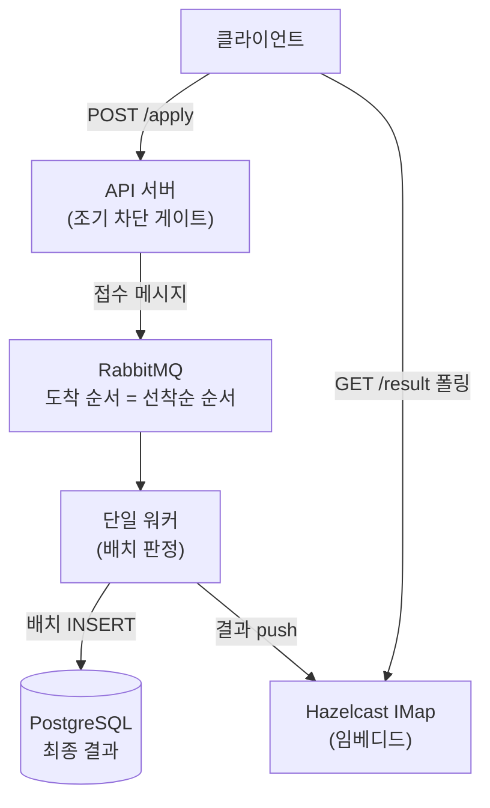

# FirstIn — 대용량 선착순 처리 데모

선착순 이벤트(한정 수량 쿠폰 발급)를 처리하는 백엔드 데모입니다. 순간적으로 폭주하는 요청 속에서 **정확히 N명만, 요청 순서대로, 중복 없이** 당첨시키는 것이 목표입니다.

동시 요청 1,000건을 쏘면 100명의 당첨자가 정확히 나오는 것을 로컬에서 재현할 수 있습니다.

## 실행

Docker만 설치되어 있으면 됩니다. 앱, RabbitMQ, PostgreSQL이 함께 기동됩니다.

```bash
# 앱 + RabbitMQ + PostgreSQL 기동 (첫 빌드 수 분 소요)
docker compose -f src/main/resources/compose.yaml up -d --build

# 앱 기동 대기 후 (10초 정도) 데모 실행
./demo.sh

# 부하 체크: RPS, 지연 분포(p50/p95/p99), 게이트 차단율, 판정 시간, CPU/MEM·큐 적체 피크
./loadtest.sh
```

부하 테스트는 `TOTAL=50000 CONCURRENCY=500 ./loadtest.sh`처럼 환경 변수로 규모를 조절할 수 있습니다.

k6가 설치되어 있으면 도착률 고정(constant-arrival-rate) 방식으로 더 정밀한 측정이 가능합니다. 이벤트 생성 → 목표 RPS 부하 → 판정 완료 대기 + 정합성 검증까지 한 번에 수행합니다.

```bash
k6 run k6/loadtest.js                                    # 기본: 1,000 RPS × 10초
k6 run -e RATE=3000 -e DURATION=30s -e STOCK=300 k6/loadtest.js
```

RabbitMQ 관리 UI(http://localhost:15672, guest/guest)를 열어두면 부하 유입 시 큐가 차올랐다가 워커가 소비하며 비워지는 과정을 눈으로 볼 수 있습니다.

### 스케일 아웃 시연

요청은 nginx 로드밸런서(8080)를 거쳐 app 레플리카에 분산됩니다. 2대로 늘리면 임베디드 Hazelcast 노드들이 자동으로 클러스터를 맺어 게이트 카운터를 공유하고, Single Active Consumer 덕에 판정 순서는 그대로 유지됩니다.

```bash
docker compose -f src/main/resources/compose.yaml up -d --scale app=2
docker compose -f src/main/resources/compose.yaml restart lb   # LB가 새 레플리카를 인식하도록 재시작

# 확인: 양쪽 로그에 Members {size:2}
docker logs firstin-app-1 | grep 'Members {size'
```

## 테스트
```bash
./gradlew test
```

## 정리
```bash
docker compose -f src/main/resources/compose.yaml down        # 컨테이너 종료
docker compose -f src/main/resources/compose.yaml down -v     # DB 데이터까지 삭제
```

## 아키텍처



요청 흐름은 세 단계입니다. 접수 단계에서 API는 게이트 통과 여부만 판단하고 메시지를 큐에 넣은 뒤 즉시 응답합니다. 판정 단계에서 단일 워커가 큐를 순서대로 소비하며 DB에 기록하고, 결과를 캐시에 밀어
넣습니다. 조회 단계에서 클라이언트는 결과 API를 짧게 폴링해 당첨 여부를 확인합니다.

## 설계 결정과 이유

이 프로젝트의 핵심은 코드보다 아래 결정들입니다.

### 1. 동시성 제어 대신 큐 기반 직렬화

선착순의 본질적인 어려움은 "선착순 확인과 차감 사이에 다른 요청이 끼어드는" race condition입니다. 흔한 해법은 Redis Lua 스크립트나 DB 락으로 경합 지점을 원자화하는 것인데, 이 프로젝트는
다른 접근을 택했습니다. **모든 요청을 큐에 넣고 워커 하나가 순차 처리**하면 경합 자체가 존재하지 않습니다.

- 큐의 도착 순서가 곧 선착순 순서가 되어, 별도의 순번 관리가 필요 없습니다.
- 원장(당첨 기록) 쓰기는 워커 하나만 수행하므로 락 경합과 커넥션 폭주가 원천적으로 없습니다. (API가 남기는 접수 로그는 게이트 카운터 복구용 append-only 기록으로, 경합 지점이 아닙니다.)
- 정합성의 근거가 "분산 락이 올바르게 동작함"이 아니라 "단일 스레드는 순차적임"이라는 훨씬 단순한 사실에 기반합니다.

트레이드오프는 판정이 비동기라는 점입니다. 사용자는 요청 즉시 당첨 여부를 알 수 없고 수 초~수십 초 뒤에 확인합니다. 쿠폰·응모형 이벤트에서는 허용되는 지연이며, 좌석 선점처럼 즉시 확정이 필요한 도메인이라면
Redis 원자 연산 기반 즉시 판정 방식이 더 적합합니다.

### 2. 조기 차단 게이트 — 느슨한 게이트, 엄격한 심판

재고 100개인 이벤트에 100만 요청이 오면, 그대로 두면 100만 건이 전부 큐에 쌓이고 워커가 전부 소비해야 끝납니다. 100번째 이후는 결과가 뻔한데도 말입니다. 그래서 API 서버에 카운터 기반 게이트를
두고, **재고의 3배를 넘는 접수는 큐에 넣지 않고 즉시 "마감" 응답**합니다.

이 게이트는 의도적으로 느슨합니다. 카운터가 정확할 필요가 없고, 재시작으로 값이 어긋나 게이트가 조금 더 열려도 괜찮습니다. **최종 판정은 어차피 워커가 큐 순서와 DB 기준으로 내리기 때문**입니다. 근사치
게이트가 트래픽의 대부분을 잘라내고, 엄격한 심판이 뒤에서 정합성을 보장하는 이중 구조 — 이 분리가 시스템 전체를 관통하는 설계 원칙입니다.

### 3. 단일 워커의 처리량 문제 — 배치로 해결

한 건씩 INSERT하는 단일 워커는 수백 TPS가 한계라 병목이 됩니다. 대신 메시지를 300건 단위로 묶어 소비하고(consumer-side batching) batch INSERT로 저장해, 단일 컨슈머로도 만
단위 TPS를 냅니다. 순서는 배치 내부에서도 유지됩니다.

큐에는 RabbitMQ의 **Single Active Consumer**를 걸었습니다. 앱 인스턴스가 여러 대여도 브로커가 컨슈머 하나만 활성화하므로 순서 보장이 유지되고, 활성 컨슈머가 죽으면 자동 승계되어 단일
워커의 SPOF 문제도 함께 해소됩니다.

### 4. 중복 방지는 애플리케이션 로직이 아니라 DB 제약으로

워커가 죽었다 살아나면 ack되지 않은 메시지가 재전달되고, 사용자가 버튼을 연타하면 같은 요청이 여러 번 큐에 들어옵니다. 두 경우 모두 원장 테이블의 `(event_id, user_id)` 유니크 제약 하나로
흡수합니다(`ON CONFLICT DO NOTHING`). "중복인지 검사한 뒤 저장"하는 로직은 검사와 저장 사이의 틈이 또 다른 race condition이 되므로, 제약 위반을 정상 흐름으로 취급하는 쪽이 더
견고합니다.

### 5. 캐시는 임베디드 Hazelcast — 인프라 단순화

게이트 카운터와 결과 캐시는 원래 Redis의 자리지만, Hazelcast를 **앱에 내장(embedded)** 하는 방식을 택했습니다. 이유는 인프라 단순화입니다. 외부 캐시 서버가 사라져 데모 전체가 컨테이너
3개(앱, RabbitMQ, PostgreSQL)로 구성되고, 카운터와 결과 조회가 네트워크 홉 없는 인프로세스 호출이 됩니다. 인스턴스를 늘리면 임베디드 노드들이 자동으로 클러스터를 맺어 외부 캐시 없이 상태가
공유됩니다.

대가는 데이터가 순수 인메모리라는 점입니다. 앱이 재시작되면 카운터와 결과 캐시가 사라집니다. 이 약점은 **DB가 최종 원장**이라는 구조로 방어합니다.

- 기동 시 DB의 접수 건수로 게이트 카운터를 재구성합니다 (`CounterRecovery`).
- 결과 조회는 캐시 miss 시 DB를 조회하는 fallback을 갖습니다.

즉 캐시 유실은 장애가 아니라 일시적 캐시 미스로 강등됩니다. 원장과 캐시의 역할을 분리해 둔 덕에 가능한 방어입니다.

### 6. 메시징은 Spring Cloud Stream — 브로커 교체 가능성

RabbitMQ를 Spring AMQP로 직접 다루는 대신 Spring Cloud Stream의 함수형 모델을 사용합니다. 배치 소비, 컨슈머 동시성 1, Single Active Consumer 같은 이 설계의
요구사항이 전부 프로퍼티로 표현되고, 비즈니스 코드에는 브로커 의존이 남지 않습니다. 바인더를 `binder-rabbit`에서 `binder-kafka`로 바꾸면 코드 수정 없이 Kafka 단일 파티션 방식으로
전환할 수 있습니다 (로드맵 참고).

### 7. 결과 통지는 push가 아니라 폴링

당첨 결과를 SSE나 WebSocket으로 push하는 방안도 검토했지만 폴링을 택했습니다. 대규모 이벤트에서 수많은 연결을 유지하는 비용(연결 보관, 결과 라우팅을 위한 pub/sub 팬아웃, 재연결 폭풍)에 비해
얻는 것은 몇 초의 통지 지연 단축뿐입니다. 이 구조에서는 워커가 수십 초 안에 전량 판정을 끝내므로 폴링 몇 번이면 결과를 받고, 서버는 완전한 무상태를 유지합니다.

폴링 부하 자체도 구조적으로 작습니다. 게이트에서 잘린 대다수는 접수 시점에 이미 결과를 받아 폴링하지 않고, 폴링하는 소수도 판정 완료와 함께 곧 멈춥니다. 응답에 `retryAfter`를 실어 폴링 간격을 서버가
통제합니다.

## 기술 스택

| 구성 요소  | 선택                             | 역할               |
|--------|--------------------------------|------------------|
| 프레임워크  | Spring Boot 4.1 (Java 21)      | API, 워커          |
| 메시지 큐  | RabbitMQ + Spring Cloud Stream | 요청 직렬화, 순서 보존    |
| 캐시/카운터 | Hazelcast 5 (임베디드)             | 조기 차단 게이트, 결과 캐시 |
| 원장     | PostgreSQL + JdbcTemplate      | 최종 판정 기록, 유니크 제약 |

## API

| 메서드  | 경로                           | 설명                                                |
|------|------------------------------|---------------------------------------------------|
| POST | `/events`                    | 이벤트 생성. 당첨자 수(`stock`) 지정, `eventId` 생략 시 자동 생성   |
| POST | `/events/{eventId}/apply`    | 접수. 게이트 통과 시 `202 QUEUED`, 마감 시 `SOLD_OUT`        |
| GET  | `/events/{eventId}/result`   | 개인 결과. `WIN` / `LOSE` / `PENDING(retryAfter)`     |
| GET  | `/events/{eventId}/status`   | 이벤트 공유 상태 (판정 진행 중 / 완료, 현재 당첨자 수)                |
| GET  | `/events/{eventId}/winners`  | 이벤트 당첨자 목록                                        |

이벤트는 사전에 `POST /events`로 생성하며, 당첨자 수(`stock`)를 이벤트별로 지정합니다. 모든 에러는 `{"code": "EVENT_NOT_FOUND", "message": "..."}` 형태로 내려가며, 코드와 HTTP 상태는 `ErrorCode` enum에서 관리합니다 (`EVENT_NOT_FOUND` 404, `DUPLICATE_EVENT` 409, `INVALID_STOCK` 400).

```bash
curl -X POST http://localhost:8080/events \
  -H 'Content-Type: application/json' \
  -d '{"eventId": "summer-sale", "stock": 100}'
```

## 디렉토리 구조

패키지는 계층이 아니라 유스케이스 기준으로 나뉘며, 위 아키텍처 그림의 박스와 1:1로 대응합니다.

```
com.firstindemo
├── event/        이벤트 — 생성 API, 이벤트별 당첨자 수(stock) 조회 (캐시 + DB fallback)
├── apply/        접수 — 컨트롤러, 게이트(AdmissionGate), 큐 발행
├── judge/        판정 — 배치 컨슈머, 판정 로직, 원장 저장
├── result/       조회 — 결과 API, 캐시 조회 + DB fallback
├── messaging/    apply와 judge가 공유하는 메시지 계약
├── code/         공용 코드 — 도메인 상태(WIN/LOSE/PENDING), 에러 코드(ErrorCode), 전역 예외 처리
└── infra/        Hazelcast 설정, 캐시 맵 이름(CacheName), 기동 시 카운터 복구
```

`apply`와 `judge`는 서로를 모르고 `messaging`에만 의존합니다. 워커를 별도 프로세스로 분리해야 할 때 `judge` + `messaging`만 떼어내면 되는 구조입니다.

## 검증

핵심 테스트는 단위 테스트가 아니라 정합성 통합 테스트입니다 (H2 인메모리 + 임베디드 Hazelcast 기반, `FirstInFlowTest`).

- 재고 100개에 동시 접수 10,000건 → 게이트 통과 정확히 300건, 당첨 정확히 100명
- 동일 메시지 재전달(워커 재시작 시나리오) → 중복 당첨 0건, 기당첨자 결과(WIN) 유지
- 기당첨자 중복 메시지 → 재고 슬롯 소모 없이 남은 재고가 신규 사용자에게 배분
- 동일 사용자 연타 → 1건만 유효

## 한계와 확장 방향

**현재 규모의 상한.** 이 구성의 병목은 워커가 아니라 접수 API의 순간 RPS입니다. 단일 인스턴스 기준 참여자 수만~수십만 명 이벤트가 현실적인 범위이며, 그 이상은 앞단에 CDN/대기열(waiting
room)과 API 수평 확장이 필요합니다. API가 무상태이고 정합성을 큐와 단일 컨슈머가 쥐고 있어, 인스턴스 추가만으로 확장되는 구조입니다.

**스케일 아웃 시.** Hazelcast 임베디드 노드들은 멤버 디스커버리 설정(TCP-IP 목록 또는 Kubernetes 플러그인)으로 클러스터를 맺습니다. Single Active Consumer 덕분에 워커
순서 보장은 인스턴스 수와 무관하게 유지됩니다. 롤링 배포 시 파티션 재분배가 일어나므로 graceful shutdown 설정을 전제로 하며, 이벤트 진행 중 배포는 피하는 것을 운영 규칙으로 둡니다.

**로드맵.**

- [x] `docker compose --scale app=2` 클러스터링 시연 (Hazelcast 멤버 자동 조인, nginx LB)
- [x] k6 부하 테스트 시나리오 (게이트 차단율, 판정 완료 시간 측정) — `k6/loadtest.js`